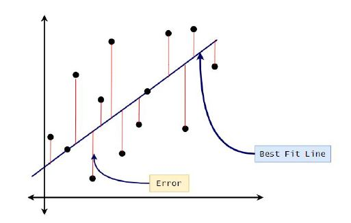
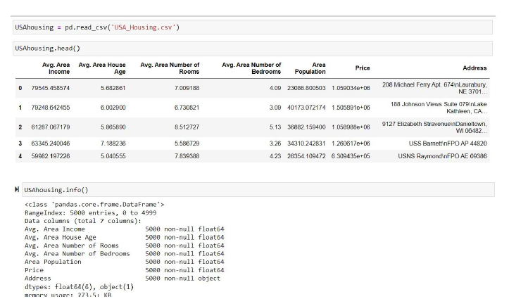
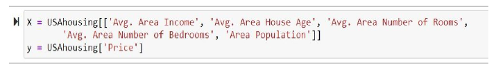
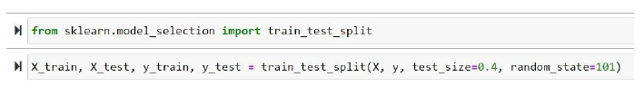
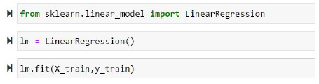
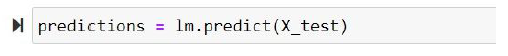
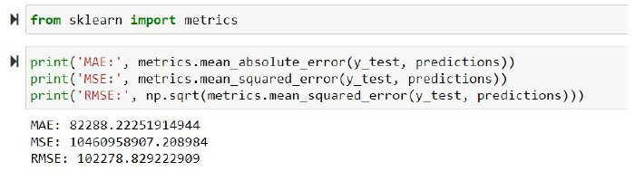
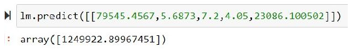

# PART-II: Linear Regression

## **Prerequisite’s**

### **Python-Resources:**
#### Blog/Articles:

- https://pythonbasics.org/
- https://medium.com/free-code-camp/learning-python-from-zero-to-hero-120ea540b567

#### Videos:
- https://www.youtube.com/watch?v=kqtD5dpn9C8

### **Numpy Resources:**
#### Blogs/Articles:
- https://medium.com/intellipaat/python-numpy-tutorial-b0118b79cf3c

#### Videos:
- https://www.youtube.com/watch?v=8JfDAm9y_7s

### **Pandas Resources:**
#### Blogs/Articles:
- https://towardsdatascience.com/in-depth-pandas-tutorial-5d896483ba8a

#### Videos:
- https://www.youtube.com/watch?v=UfmtEEXlP8E&feature=youtu.be

### **Matplotlib Resources:**
#### Blogs/Articles:
- https://medium.com/@kacawi/matplotlib-tutorial-python-plotting-6729f92b1bcb

#### Videos:
- https://www.youtube.com/watch?v=yZTBMMdPOww&feature=youtu.be

### **What Is Regression?**
**Regression** analysis consists of a set of machine learning methods that allow us to predict
a continuous outcome variable (y) based on the value of one or multiple predictor variables
(x). Briefly, the goal of a regression model is to build a mathematical equation that defines y
as a function of the x variables. There are two types of regression, linear and logistics.

**Linear Regression** is the oldest, simple, and widely used supervised machine learning algorithm for
predictive analysis.

### **Regression Use Cases**
- Prediction (E.g.: Predicting Real Estate Prices.)
- Forecasting (E.g.: Predicting demand for goods and services).

### **Linear Regression Algorithm**
&emsp;Let’s take a look at what goes under the hood and have a rough idea of what the
algorithm does before jumping into the code.

The **Simple Linear Regression Model** attempts to model the relation between two
variables by fitting a linear equation to observed data. One variable is considered to be an
independent variable while the other is considered to be a dependent variable

Here, talking about the graph, the equation of the line can generally, be taken as  
&emsp;&emsp;&emsp;y = m x + c  
where y is the dependent variable and x is the independent variable

m here is the slope of the line and c is intercept (here at the y axis),  

Linear Regression intends to find out the best values for m and c to fit the best possible line
in the graph, by finding the optimal values for m and c here. There are multiple ways of
finding the best fit line, a common one is using the least-squares method. Here the goal is to
fit a line in which vertical distance between the data points and the line is minimum.

  

###  Further concepts regarding the maths and intuition behind it would be explained in phase 3

 

## **CODE**
Here we shall try creating a linear regression model which we will use to predict housing
prices.

The dataset is available on Kaggle.com

https://www.kaggle.com/vedavyasv/usa-housing?select=USA_Housing.csv

 
The dataset contains the following columns:

- 'Avg. Area Income': Avg. The income of residents of the city house is located in.
- 'Avg. Area House Age': Avg Age of Houses in the same city
- 'Avg. Area Number of Rooms': Avg Number of Rooms for Houses in the same city
- 'Avg. Area Number of Bedrooms': Avg Number of Bedrooms for Houses in the same
city
- 'Area Population': Population of city house is located in
- 'Price': Price that the house sold at
- 'Address': Address for the house

Since price is what we intend to predict, it will be our dependant variable.

Moving on to the code…

### Importing Libraries
    import pandas as pd
    import numpy as np
    import matplotlib as plt
    %matplotlib inline

### **Checking Out the data and loading the CSV file.**
 

  

Let's now begin to train the regression model! We will need to first split up our data into an X
array that contains the features to train on, and a y array with the target variable, in this case,
the Price column. We will toss out the Address column because it only has text info that the
linear regression model can't use.

  

### **Splitting the data set**
Now we further split the dataset into training and testing sets. This is done so that the model
won't
Show bias by overfitting the dataset and we get to know the true accuracy of the model.

  

### **Creating and Training the model**
 

  

So now we have created a linear regression model and fitted it into our training data set.
**Predicting**
 

  

### **Evaluation Metrics**

Here are three common evaluation metrics for regression problems: 
**Mean Absolute Error** (MAE) is the mean of the absolute value of the errors: 
**Mean Squared Error** (MSE) is the mean of the squared errors: 
**Root Mean Squared Error** (RMSE) is the square root of the mean of the squared errors:

Comparing these metrics:
- **MAE** is the easiest to understand because it's the average error.
- **MSE** is more popular than MAE because MSE "punishes" larger errors, which tends to be useful in
the real world.
- **RMSE** is even more popular than MSE because RMSE is interpretable in the "y" units.

All of these are **loss functions** because we want to minimize them.

  

This is the error that our linear regression model shows in its predictions. It is a simple model
and the predictions can be made more accurate by using a more complex model and by
using hyperparameter tuning and also using techniques to include the text data that is the
address feature here.

### **Further Predicting**

We can further predict the values of the housing prices

  

**Over here a house of 79545.4567 Avg. Area Income,5.6873 Avg. Area House Age,7.2 Avg.
Area Number of Rooms, 4.05 Avg. Area Number of Bedrooms
and having an average population of 23086.100502 will have an average price of
$1249922.89967451.**

